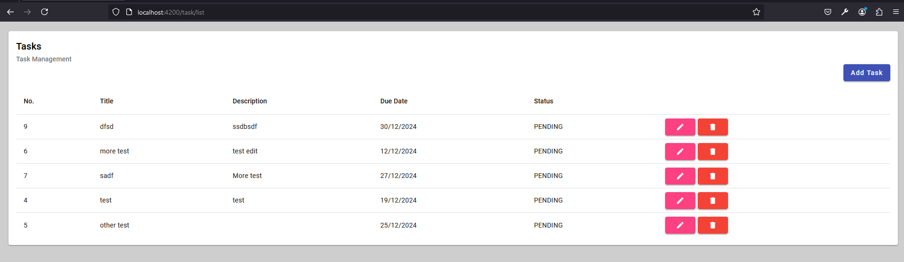
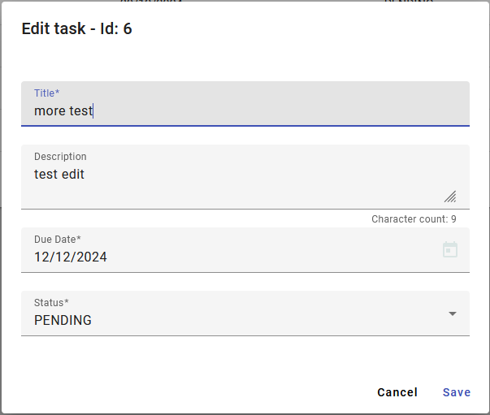

# Task Management Application

Build a simple Task Management System where users can perform CRUD operations (Create
Read, Update, Delete) for tasks. Tasks will include a title, description, due date, and status
(Pending/Completed).

**Tech Stack**:
- **Backend**: Java Spring Boot
- **Frontend**: Angular
- **Database**: PostgreSQL/MySQL
- **API Testing**: Postman or equivalent

## Database

The database was create on PostgreSQL, here is the required DDL:

``` SQL
CREATE TABLE public.task (
	id int4 NOT NULL,
	title varchar(64) NOT NULL,
	description varchar(256) NULL,
	due_date date NOT NULL,
	status varchar(16) NOT NULL,
	CONSTRAINT task_check CHECK (((status)::text = ANY ((ARRAY['PENDING'::character varying, 'COMPLETED'::character varying])::text[]))),
	CONSTRAINT task_pk PRIMARY KEY (id)
);
```

``` SQL
CREATE SEQUENCE public.seq_task_id
	INCREMENT BY 1
	MINVALUE 1
	MAXVALUE 9223372036854775807
	START 1
	CACHE 1
	NO CYCLE;
```


## API

The endpoints were developed with Java/ Spring Boot, this is the file with the API test requests: [Postman Collection](./docs/Java%20-%20Task%20Management.postman_collection.json)

## UI
|  |
|:--:| 
| *List of task* | 

|  | 
|:--:| 
| *New Task* |

|  | 
|:--:| 
| *Update task* |

|  | 
|:--:| 
| *Delete task* |